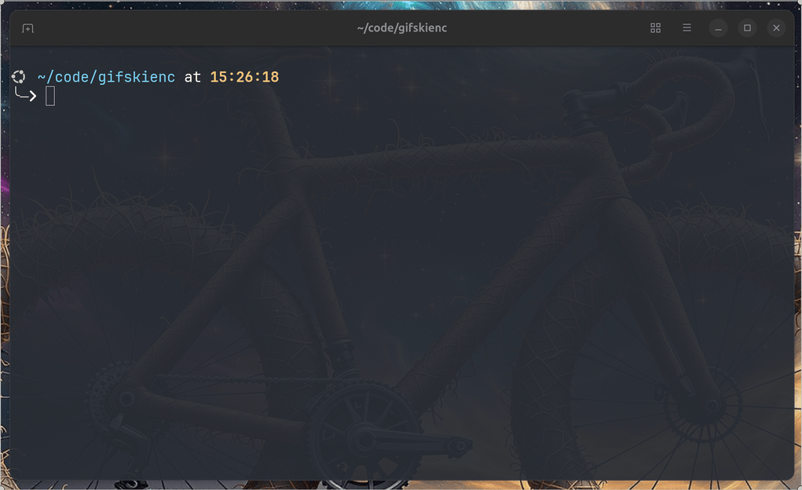

# GStreamer GIF plugin via Gifski

This is a GStreamer plugin that uses the [Gifski](https://gif.ski) library to encode GIF animations.



## Pre-requisites
You'll need:
- Gstreamer and Gstreamer video development packages. You can install them via your package manager.
- Gifski library installed on your system. You can download it from the [official website](https://gif.ski).

## Installation

You might need to adjust the Gifski installation path inside the Makefile first. Then run:
```bash
make
make install
```

## Usage

An example pipeline that generates a GIF from a test video source:
```bash
gst-launch-1.0 -v videotestsrc is-live=false num-buffers=100 ! videoconvert ! gifskienc location=test.gif ! fakesink
```

> [!NOTE]
> A `fakesink` is always required at the end of the pipeline to consume the data. This is because the element writes to the file directly via Gifski.

### Properties

The element supports the following properties:

- `location`: The location to write the GIF file to. This is a mandatory property.
- `quality`: The quality of the GIF. This is a value between 1 and 100. The default is 90.
